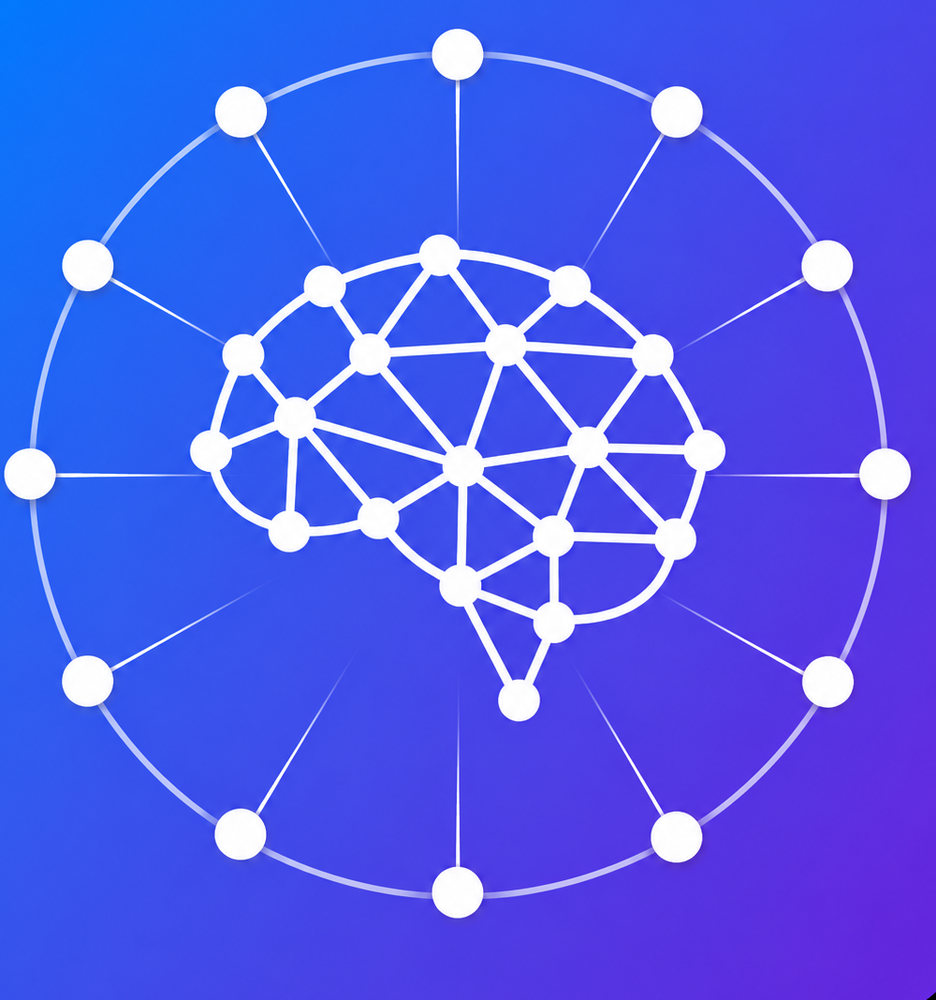
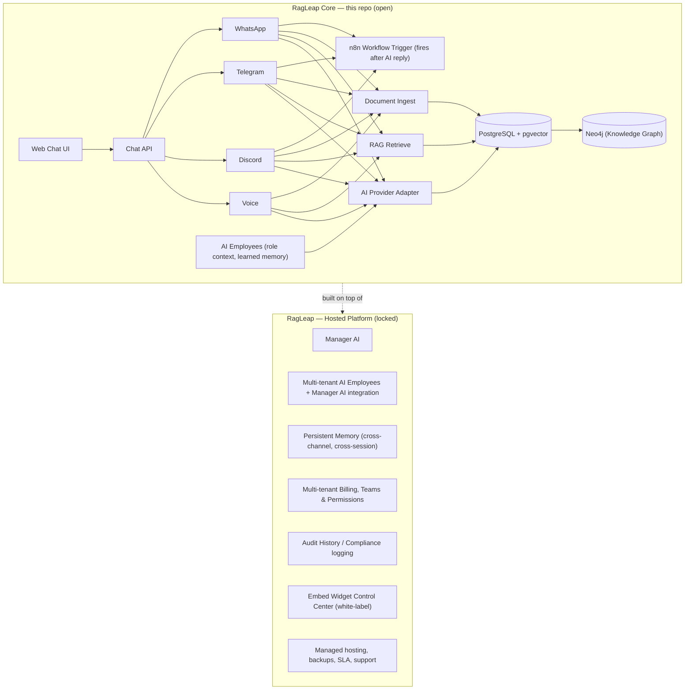
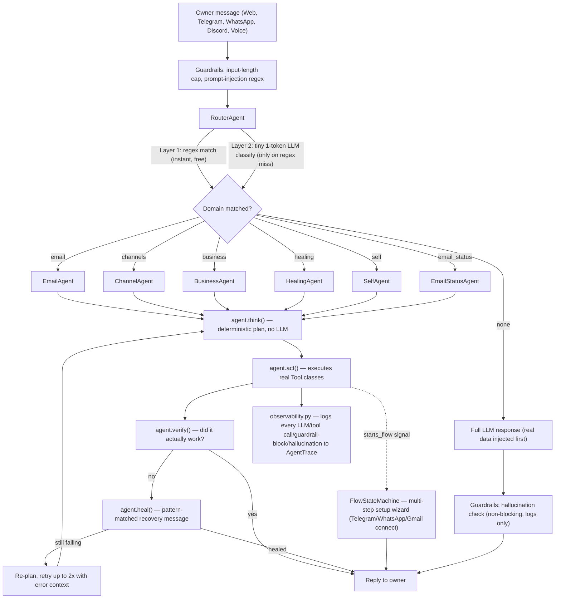
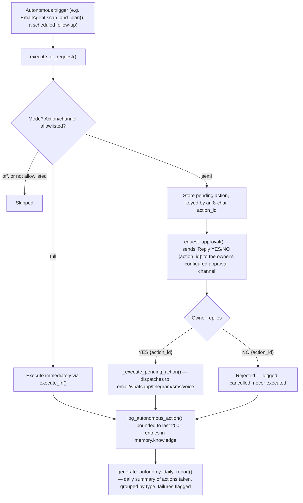
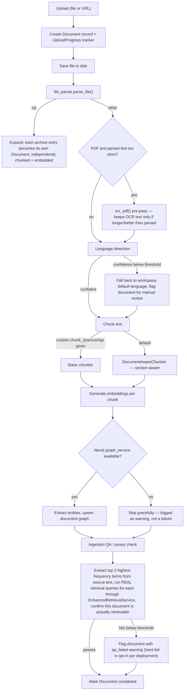
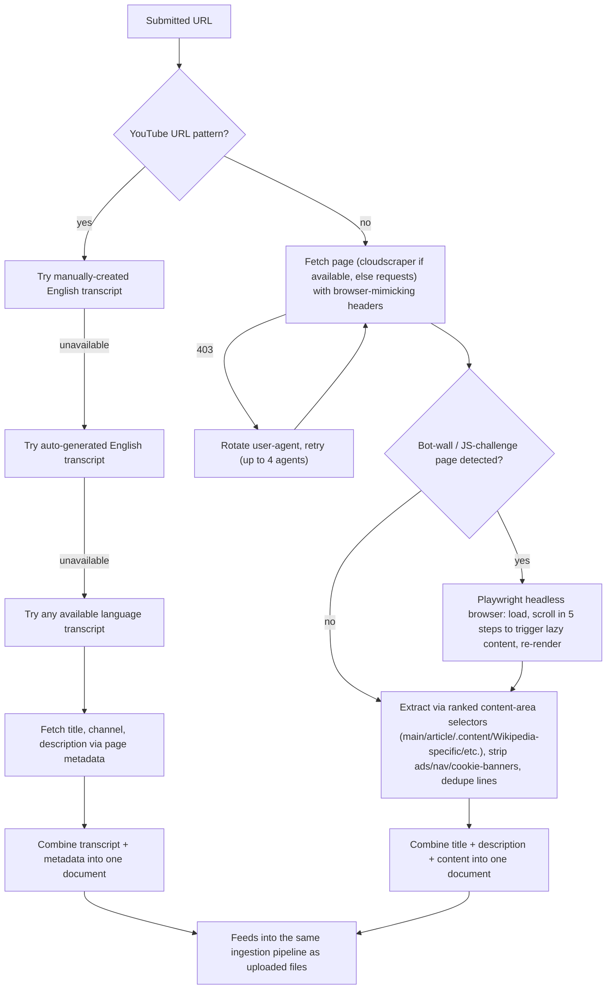
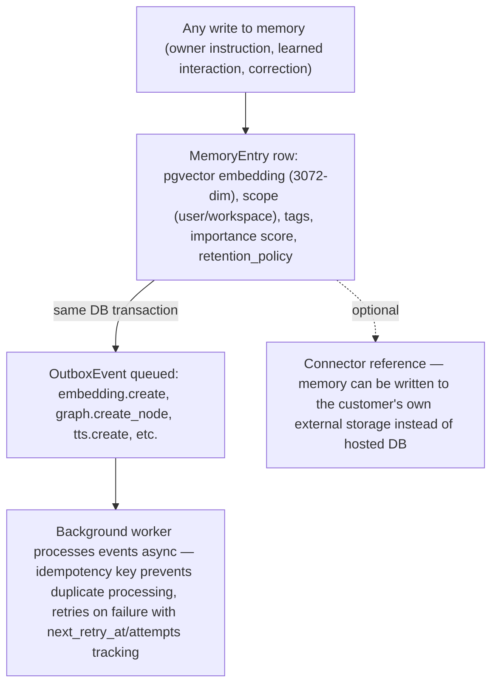
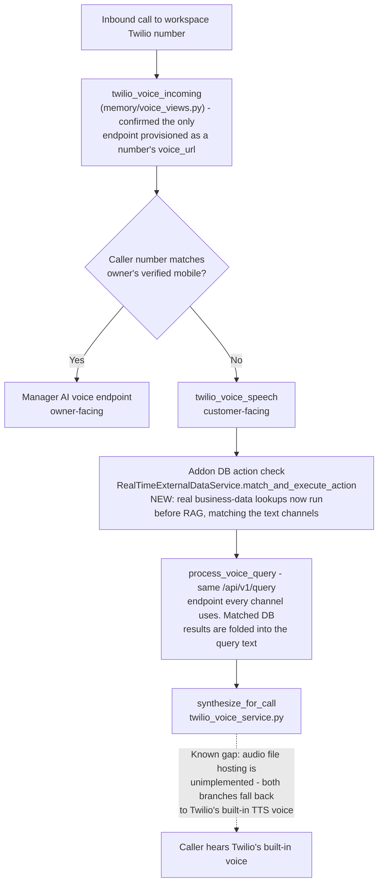
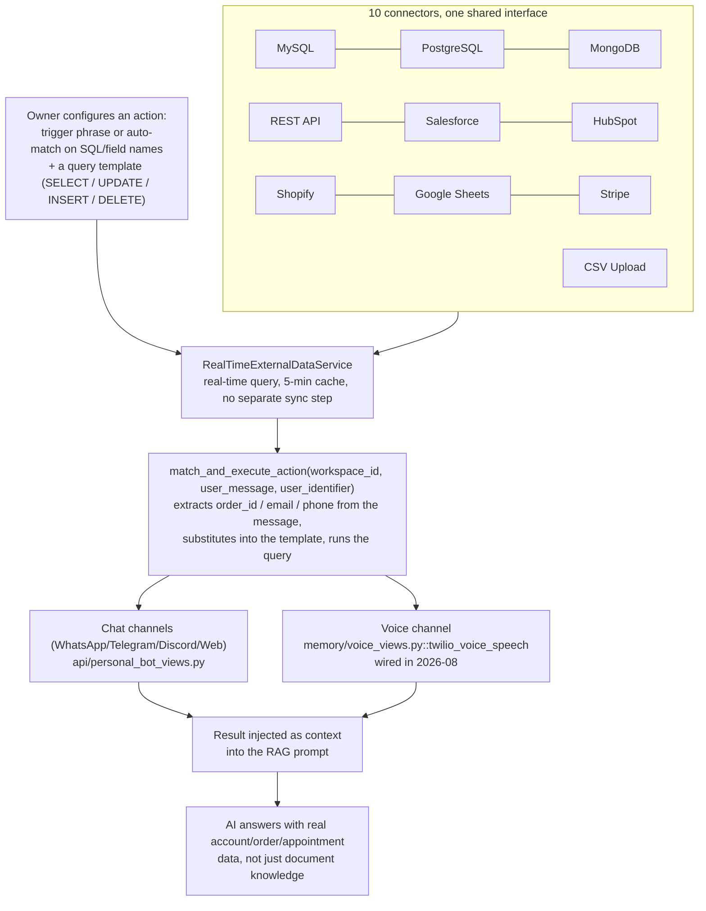

<div align="center">



# RagLeap Core

**Autonomous AI Agents — Not Just RAG.**

[](LICENSE) [](https://github.com/antonyrag/ragleap-core/releases) [](https://github.com/antonyrag/ragleap-core) [](https://github.com/antonyrag/ragleap-core) [](https://github.com/antonyrag/ragleap-core)
[](https://pypi.org/project/ragleap-rag/) [](https://pypi.org/project/ragleap-rag/)
[](https://pypi.org/project/ragleap-graph/) [](https://pypi.org/project/ragleap-graph/)
[](https://github.com/antonyrag/ragleap-core)

</div>

RagLeap Core is the open-source engine behind RagLeap — a self-hosted, agentic system that runs your business from your own documents on your own server, with no vendor lock-in.

**9 role-based AI Employees:** AI Manager, Personal Secretary, Customer Support, Telecaller, DB Analyst, Broadcast Agent, Personal Assistant, AI COO, AI Engineer.

**What it does:**
- Self-learning, outcome-weighted memory
- Auto-trigger workflows and escalation
- Full / semi autonomy modes
- Think-act-decide loop, not just retrieval

[Quickstart](#quickstart) · [Docs](https://docs.ragleap.com) · [Website](https://ragleap.com) · [Hosted Version](https://ragleap.com) · [Packages](https://packages.ragleap.com/)

---

> **Not to be confused with `install.ragleap.com`** — that's a separate, paid, license-gated self-hosted product (Free tier with a license key, up to Enterprise). `ragleap-core` (this repo) is MIT-licensed, completely free, and never requires a license key. If you cloned this repo, you're in the right place for a genuinely free, open-source RAG engine.

## Install

```bash
pip install ragleap-rag
```

> ⭐ If this helps you, please consider starring the repo — it genuinely helps more people find it.

Add `ragleap-graph` too if you want Neo4j-backed knowledge graph retrieval:
```bash
pip install ragleap-rag ragleap-graph
```

Or run the full self-hosted app (channels, web chat UI, Docker Compose) — see [Quickstart](#quickstart) below. Browse every package at [packages.ragleap.com](https://packages.ragleap.com). Try it hands-on with the runnable scripts in [examples/](examples/) — `01_ingest_and_query.py` (upload a document, ask a question via the API) and `02_test_channel_directly.py` (test channel answering logic without real bot credentials).

## If a RAG chatbot answers questions, RagLeap runs your business

Most open-source RAG projects give you a toolkit — you still have to build the app, wire up a UI, add memory, and connect every channel yourself. RagLeap Core gives you a working chat engine out of the box, and the full RagLeap platform turns it into an AI that actually operates a business.

| Without RagLeap | With RagLeap |
|---|---|
| ❌ A different bot for your website, WhatsApp, and Telegram — none of them share memory | ✅ One AI across every channel, with memory that persists between them |
| ❌ Your RAG chatbot forgets everything the moment a session ends | ✅ Persistent memory — facts and preferences carry across sessions and channels |
| ❌ You're a developer, so you can wire up LangChain — but your team can't manage it | ✅ A real dashboard for non-technical owners: settings, analytics, team, billing |
| ❌ Answering customer questions and running the business are two separate systems | ✅ Manager AI — an executive assistant that can see analytics, send emails, and manage settings by conversation |
| ❌ Adding a phone line means integrating Twilio, STT, and TTS yourself | ✅ Voice AI is built in — real inbound calls, answered and routed automatically |
| ❌ Automating a workflow means writing custom code per integration | ✅ n8n workflow automation triggered directly from any conversation |

## What makes RagLeap Core specifically different

This repo isn't a general-purpose RAG framework you assemble into something — it's the real, working engine that already powers a production AI business platform (see [What's in the hosted version](#whats-in-the-hosted-version-ragleapcom) below). The code here is honest about being early, but it's extracted from something that already works in the real world, not built as a demo.

## Why RagLeap exists

Open-source AI agent projects like OpenClaw took off for a specific reason: people wanted an assistant that runs on **their own infrastructure**, with **their own keys**, answering from **the chat apps they already use** — not a black box hosted by someone else. That same principle is what RagLeap Core is built on for business AI specifically.

**Your keys, your infrastructure, your data.** RagLeap Core never asks for a system API key. You bring your own Gemini key, you run your own PostgreSQL database, your documents never leave your server unless you choose the hosted version.

**Chat is the interface, not a separate dashboard you have to learn.** The same way OpenClaw meets people on WhatsApp, Telegram, and Slack, RagLeap's full platform meets business owners on the channels they already use — WhatsApp, Telegram, Discord, and real phone calls — not a new app they have to check.

**A real, working system — not an abstract framework.** This isn't a toolkit like LangChain where you assemble your own app from primitives. RagLeap Core is the actual chunking → embedding → retrieval → generation pipeline extracted from a production system that already answers real customer questions, at a company that already runs on it.

**Built in public, honestly.** This repo says clearly what's done and what isn't. No inflated claims, no vaporware Quickstart commands that don't work yet — the Roadmap reflects the real state of the code, updated as it progresses.

## What RagLeap Core is

RagLeap Core is a document-grounded chat engine. Upload your documents, ask questions, get cited answers — self-hosted, on your own infrastructure, with your own API key.

WhatsApp, Telegram, and Discord bots are included in this repo too — single-tenant, .env-configured channel adapters that answer from the same document knowledge base. It is the foundation of [RagLeap](https://ragleap.com), a hosted AI business manager that adds Voice calling, multi-tenancy, a persistent memory system, and an executive-assistant layer on top of this same core engine.

**If RagLeap (hosted) is the business, RagLeap Core is the engine room.**

## RagLeap Core is right for you if

- ✅ You want a self-hosted RAG chatbot with full control over your data
- ✅ You want to understand exactly how document retrieval and citation works, not use a black box
- ✅ You're comfortable running your own server and your own AI provider key
- ✅ You want to contribute to or extend an open document-QA engine
- ✅ You'd rather see the code than trust a vendor's word on data privacy

## What RagLeap Core is not

| It's not... | It is... |
|---|---|
| A hosted product | Self-hosted software you run yourself |
| Multi-tenant, with persistent cross-session memory | Single-tenant — one bot, one document set, per deployment |
| A multi-tenant platform | WhatsApp/Telegram/Discord/Voice channel adapters included, single-tenant — multi-tenant routing lives in the hosted version |
| A no-code SaaS dashboard | A codebase you deploy and configure |
| Feature-complete with the hosted version | The foundational subset — see [Roadmap](#roadmap) |

## Features

| | |
|---|---|
| 📄 **Document ingestion** | Upload PDFs, text, and common document formats |
| 🔍 **RAG retrieval** | Vector search over your documents via pgvector |
| 💬 **Chat with citations** | Answers reference the source document, not a black box |
| 🔌 **Bring your own AI key** | OpenAI, Gemini, Anthropic, or any OpenAI-compatible endpoint |
| 🌐 **Web chat widget** | Embed a chat widget on any website |
| 🐳 **Docker-based setup** | One-command local deployment |
| 🕸️ **Knowledge Graph (Neo4j)** | Entity extraction and graph-boosted retrieval alongside vector search |
| 🌍 **Language detection** | Auto-detects document and query language, applied across every channel |
| 🔗 **Integrations** | Connect MySQL, PostgreSQL, MongoDB, REST APIs, Salesforce, HubSpot, Shopify, Google Sheets, Stripe |
| 🔀 **Hybrid search** | Combines dense (vector) and sparse (full-text) retrieval via Reciprocal Rank Fusion |
| ⚡ **Streaming responses** | Answers stream token-by-token instead of waiting for the full response |
| 🔁 **Provider fallback** | Automatically retries with a backup LLM provider if the primary fails |
| 💰 **Token usage reporting** | Real per-call token counts from the provider, plus context-size budget trimming |
| 🧑‍💼 **AI Employees** | Role-based agents (9 default roles) with persistent business-context memory, wired into `/chat` via `role=<role>` |
| 🔗 **n8n workflow automation** | Fire a webhook after the AI replies on WhatsApp/Telegram/Discord — no-code automations triggered directly from a conversation |
## Architecture

RagLeap Core is the foundation layer of the full RagLeap platform. Here's how it fits into the bigger picture:



**[locked]** = commercial/hosted-only feature, not included in this repository. See below for the full breakdown.

### Repo structure

```
ragleap-core/
├── core/                  # RAG engine — chunking, embedding, retrieval, generation
│   ├── chunker.py
│   ├── embedding.py       # Gemini embeddings (gemini-embedding-001, 3072-dim)
│   ├── retrieval.py       # pgvector cosine search
│   ├── generation.py      # 19-provider BYOK generation (Gemini, OpenAI, Anthropic, etc.)
│   ├── ingest.py          # chunk -> embed -> store pipeline
│   ├── parsers.py         # PDF/DOCX/TXT text extraction
│   ├── employees/         # AI Employees — roles, business profile, learned memory
│   ├── workflows.py       # n8n workflow automation — webhook triggers
│   └── api.py             # FastAPI app — /health, /upload, /chat, /profile, /employees, /n8n-workflows, /webhook/*
├── channels/              # Messaging + voice channel adapters
│   ├── whatsapp/          # Twilio + Gupshup
│   ├── telegram/
│   ├── discord/
│   └── voice/             # Twilio Media Streams, WebSocket server
├── db/
│   └── schema.sql         # documents + chunks tables, pgvector index
├── examples/              # Runnable example scripts
├── .github/workflows/     # CI: compile check, Docker build, smoke tests
├── docker-compose.yml     # app + db + voice services
└── Dockerfile
```

## What's in the hosted version (ragleap.com)

RagLeap Core covers document upload, retrieval, and web chat. The hosted platform builds a full AI business manager on top of it:

| Area | What it adds |
|---|---|
| **Manager AI** | A private executive assistant for the owner — sees documents, analytics, team permissions, and database connections; can send emails, generate reports, and manage settings by conversation, reachable via Web, WhatsApp, Telegram, or phone call |
| **AI Employees** | Single-tenant runtime (9 roles, pgvector-backed learned memory) is open in this repo's `core/employees/`; the hosted platform adds multi-tenant per-workspace seeding and Manager AI integration on top |
| **Voice AI** | Real inbound phone calls via Twilio — speech-to-text, RAG-grounded response, text-to-speech, with owner vs. customer call routing |
| **Multi-channel bots (multi-tenant)** | WhatsApp (Twilio or Gupshup), Telegram, and Discord — single-tenant versions are in this repo; the hosted version adds multi-tenancy, per-workspace routing, and shared config across channels |
| **Persistent Memory** | Facts and preferences that persist across sessions and channels, not just within a single conversation |
| **Advanced AI Settings** | Model selection (Gemini/OpenAI/Claude), temperature tuning, bring-your-own-key per provider, and automatic failover across a fallback key pool |
| **Team Chat** | Internal team messaging board per workspace, separate from customer-facing AI chat |
| **n8n Workflows** | Single-tenant webhook triggers (WhatsApp/Telegram/Discord) are open in this repo's `core/workflows.py`; the hosted platform adds multi-tenant per-workspace routing and Voice channel coverage |
| **222+ Languages** | This repo includes language detection (langdetect, ~55 languages) across all channels; the hosted platform extends this to 222+ languages with per-user persisted preferences |
| **Integrations & Database Connectors** | This repo includes 9 raw connectors (MySQL, PostgreSQL, MongoDB, REST API, Salesforce, HubSpot, Shopify, Google Sheets, Stripe) with on-demand sync; the hosted platform adds AI-suggested automations per channel and developer-level custom automation workflows on top |
| **Analytics Dashboard** | Per-provider usage breakdown (OpenAI, Gemini, Claude), query volume, token costs, and daily trends |
| **Team & Billing** | Multi-tenant workspaces, team member permissions, subscription plans, usage-based billing |
| **Audit History** | Full log of configuration changes — who changed what, and when |
| **Embed Control Center** | White-label widget builder — Bubble, Fixed Panel, or Full Page embeds for any website |
| **Data Visibility Controls** | Per-document and per-database Public/Private settings — control exactly what customer-facing bots see vs. what's reserved for Manager AI only |
| **Observability & Hallucination Detection** | Built-in monitoring layer that audits AI responses for accuracy and flags potential hallucinations |
| **Cloud or Self-Hosted deployment** | Run the full platform as managed cloud (subscription) or self-hosted on your own server (one-time license) |
| **Managed hosting** | Backups, uptime SLA, and support — zero infrastructure to maintain |

This is the standard **open-core model** — the same approach used by projects like n8n, Supabase, and Cal.com: the engine is free and open, the managed/extended product is commercial.

## Full Technical Architecture (Hosted Platform)

> This section documents the real internals of the hosted RagLeap platform — gathered by reading actual production source, not summarized from memory or marketing copy. Where something is confirmed *not* to be live (dead code, an unwired tool), it's labeled as such rather than omitted. This is a living section — deeper subsystems (billing, multi-tenant workspace routing) are deliberately excluded here since they're operational/SaaS infrastructure, not differentiating technology.

### System Overview

```mermaid
flowchart TD
    subgraph Channels["Entry points"]
        Web[Web Chat] --- WA[WhatsApp] --- TG[Telegram] --- DC[Discord] --- Vc[Voice / Twilio]
    end

    Channels --> Router{"Owner or customer?<br/>(Voice: verified mobile number match.<br/>Text: personal bot vs. customer-facing config)"}

    Router -->|Owner| MgrL1["Manager AI - Layer 1: Agent Framework<br/>regex router first, LLM classifier only on miss<br/>6 specialist agents, think/act/verify/heal loop"]
    MgrL1 --> MgrL2["Layer 2: Autonomous Loop<br/>off / semi / full modes, per-workspace<br/>action + channel allowlists, approval protocol"]
    MgrL2 --> MgrL3["Layer 3: LLM<br/>only reached when Layer 1 can't match an intent<br/>always given real, current workspace data"]
    MgrL3 -.->|not yet wired, see Known Gaps| RAGShared["Customer-facing RAG index"]

    Router -->|Customer| Addon["Addon DB action check<br/>RealTimeExternalDataService<br/>owner-configured SELECT/UPDATE/INSERT/DELETE"]
    Addon --> RAG["RAG Retrieval<br/>pgvector cosine search + Neo4j entity-graph boost"]
    RAGShared --- RAG

    RAG --> Employees["AI Employees<br/>9 roles, pgvector learned memory,<br/>skill-based context injection"]
    Employees --> Gen["Generation<br/>19-provider BYOK (Gemini/OpenAI/Anthropic/etc.)"]

    Gen --> Mem["Persistent Memory<br/>transactional outbox: embedding/graph/TTS writes<br/>queued in the same DB transaction as the memory row"]

    Ingest["Document / URL Ingestion<br/>OCR fallback, language detection,<br/>canary QA retrieval check before marking complete"] --> RAG

    style MgrL3 fill:#2a2a3a,stroke:#66a
    style RAGShared fill:#3a3a2a,stroke:#aa4
```



**How to read this**: solid arrows are confirmed, live data flow. Dotted arrows mark a real gap between two systems that look like they should already be connected but aren't (see `RAGQueryTool` in the Manager AI section below — Manager AI cannot currently query the customer-facing RAG index despite a tool existing for exactly that purpose). Each subsystem below is documented on its own with the same standard: read from real source, verified live or explicitly marked otherwise.

### Manager AI — Three-Layer Design

Manager AI answers most owner requests **without calling an LLM at all**. A regex-based router matches intent first; only genuinely ambiguous requests reach a model, and even then the model is always given real, current workspace data rather than reasoning blind.



**Verified live.** Every node above was confirmed by reading the actual source: `api/agent_framework.py` (base `Agent`/`Tool`/`AgentOrchestrator` classes), `api/agents/*.py` (6 specialist agents), `api/agents/router_agent.py`, `api/agents/agent_brain.py`, `api/agent_state_machine.py`, `api/guardrails.py`, `api/observability.py`.

**Confirmed dead code — not live, listed here so nobody rediscovers them by accident:**
- 8 tool classes in `api/agent_tools.py` are fully implemented but called from nowhere in the codebase: `RAGQueryTool`, `DocumentReadTool`, `DocumentUploadTool`, `MemoryReadTool`, `MemoryWriteTool`, `MemorySearchTool`, `AgentStateReadTool`, `AgentStateWriteTool`. Notably, `RAGQueryTool` means Manager AI does **not** currently share live query access with the customer-facing RAG system, despite a tool existing for exactly that purpose.
- `send_owner_whatsapp`, `send_owner_telegram`, `send_owner_sms` are each defined **twice** in `api/manager_actions.py`. `ACTION_REGISTRY` (the real dispatch table) is built before the second definitions appear, so it's permanently bound to the first, shorter versions — the second, longer versions are unreachable dead code, *unless* something imports them directly by name (confirmed: nothing currently does).

### Manager AI — Layer 2: Autonomous Loop

Beyond responding to owner messages, Manager AI can act on its own — within limits the owner explicitly configures. Three modes, per workspace: `off` (owner-initiated only, the default), `semi` (AI proposes, owner approves via a reply), `full` (AI executes directly and reports).



**Verified live**, read in full from `api/autonomy_engine.py`. Two independent gates apply before mode even matters: an `actions` allowlist and a `channels` allowlist, both configurable per-workspace — so "full autonomy" doesn't mean unrestricted, it means unrestricted *within whatever the owner explicitly turned on*. The approval flow in `semi` mode is a genuine two-way protocol, not a one-shot notification: the owner's exact reply (`YES ABC123` / `NO ABC123`) is parsed and matched back to the specific pending action before anything executes.

### Action Dispatch — 70 named actions, one registry

`api/manager_actions.py`'s `execute_action(action_type, workspace, params, memory)` dispatches by string name through `ACTION_REGISTRY`, a dict of ~70 real handler functions. Natural-language flexibility comes from **deliberate many-to-one aliasing** — e.g. `get_all_settings` is reachable via 5 different phrasings (`show_settings`, `current_settings`, `ai_settings_info`, `view_settings`), each mapped to the same function — not fuzzy matching.

Two real behaviors worth noting precisely:
- **Learns from correction**: before executing a channel-config action, `execute_action()` checks `memory.preferences['providers_rejected']` — if the owner previously rejected a provider, it won't silently reconfigure it again.
- **Owner vs. customer channels are genuinely separate action families**: `whatsapp_config`/`telegram_config`/`discord_config` set up the *customer-facing* bot; `telegram_personal_bot_config`/`whatsapp_personal_bot_config`/`discord_personal_bot_config` (each a `lambda` wrapping `save_personal_bot_config(ws, platform, ...)`) set up the *owner's own* channel for talking to Manager AI. Same channel types, two distinct configurations.

### Document Ingestion Pipeline



**Verified live**, read in full from `ingestion/pipeline.py` (854 lines). The canary QA step is the most distinctive piece: rather than just checking "did the embedding API call succeed," it runs the document's own most distinctive terms back through the real production retrieval path and confirms the document itself shows up in results — proving end-to-end searchability, not just successful ingestion.

**Known limitation, relative to the open-source `ragleap-core` repo**: the open-source `core/chunker.py` only has the basic chunker — `DocumentAwareChunker`'s section-aware chunking is hosted-only.

### URL Extraction (documents from web pages and YouTube)



**Verified live**, read in full from `ingestion/url_extractor.py` (653 lines). Worth noting plainly: this extractor uses real anti-bot-detection techniques (`cloudscraper` for Cloudflare bypass, rotating user-agents, browser-mimicking request headers) to reliably extract content from sites that actively try to block automated access — a deliberate, real engineering choice, not incidental.

### Persistent Memory



**Verified live**, read from `memory/models.py`'s `MemoryEntry` and `OutboxEvent` models. The transactional outbox pattern is genuinely notable: side effects (embedding generation, graph writes) are queued in the *same database transaction* as the memory write itself, so a crashed background worker can't cause a memory entry to silently end up without its embedding — the event just waits, retried, until it succeeds.

### Voice Channel Routing (Hosted)



**Verified live**, read from `memory/voice_views.py` and `memory/twilio_voice_service.py`. Two things worth being direct about:

- **Fixed**: customer voice calls previously had no path to real business data — a caller asking about an order or appointment could only get a RAG answer from documents, never a live database lookup, unlike WhatsApp/Telegram/Discord. `twilio_voice_speech` now runs the same `RealTimeExternalDataService.match_and_execute_action` step already used by the text channels before handing off to RAG, so a match gets folded into the query the AI answers from.
- **Still open**: ElevenLabs TTS is never actually delivered to callers. `synthesize_for_call` in `twilio_voice_service.py` has an unimplemented audio-hosting step (`# TODO: Implement audio file hosting/S3 upload`) — both the success and fallback branches currently produce the same result, Twilio's built-in voice. A separate, unrelated ElevenLabs helper (`api/voice_ai.py::generate_elevenlabs_twiml`) does correctly upload synthesized audio to the project's R2/S3 storage, but it is not currently called from any live voice path — fixing this gap means wiring that upload logic into `synthesize_for_call` itself, not assuming the existing helper is already doing the job.

## Quickstart

> ✅ **Status: core pipeline verified working.** Ingest -> embed -> retrieve -> generate runs end-to-end via Docker Compose, including a clean fresh-clone test. See the [Roadmap](#roadmap) for what's next (PDF/DOCX support, alternative BYOK providers).

**Fastest way to try it** — one command checks Docker, clones the repo, and sets up `.env` for you:

```bash
curl -fsSL https://raw.githubusercontent.com/antonyrag/ragleap-core/main/install.sh | bash
```

(Windows users: run this in Git Bash, not Command Prompt or PowerShell.)

The script will pause after cloning and ask you to add your Gemini API key to `.env` — get a free one at [aistudio.google.com/apikey](https://aistudio.google.com/apikey), then re-run the same command.

**Or, the manual way** — better if you want to read the code before running anything:

```bash
git clone https://github.com/antonyrag/ragleap-core.git
cd ragleap-core
cp .env.example .env
# add your Gemini API key to .env
docker compose up --build -d
```

Requirements: Docker, Docker Compose, an API key from OpenAI, Google Gemini, or Anthropic.

**Try it in 30 seconds** — with the stack running, see [examples/](examples/) for two verified, runnable scripts:
- `examples/01_ingest_and_query.py` — upload a document and ask a question via the API
- `examples/02_test_channel_directly.py` — test the WhatsApp/Telegram/Discord answering logic without real bot credentials

## Just want the RAG engine as a Python library?

If you don't need the full Docker app — WhatsApp/Telegram/Discord/Voice adapters, the web chat UI, all of it — the core retrieval engine is also published as standalone, pip-installable Python packages:

```bash
pip install --index-url https://packages.ragleap.com/simple/ ragleap-rag
```

- **`ragleap-rag`** — the chunking → embedding → retrieval → generation pipeline as a library. Pluggable embeddings (12+ providers), 6 vector backends (FAISS, PgVector, Pinecone, Weaviate, Qdrant, Milvus), cross-encoder reranking, and more.
- **`ragleap-graph`** — Neo4j-backed knowledge graph retrieval, usable standalone or alongside `ragleap-rag`.

Both are MIT licensed. Browse the full package index at [packages.ragleap.com](https://packages.ragleap.com).

## Supported LLM Providers (BYOK)

RagLeap Core is bring-your-own-key only there is no system-provided key for any provider. Set `LLM_PROVIDER` in `.env` to choose which one to use for the generation (chat) step. Embeddings currently always use Gemini (`gemini-embedding-001`), regardless of `LLM_PROVIDER`.

| `LLM_PROVIDER` value | Required env vars | Notes |
|---|---|---|
| `gemini` (default) | `GEMINI_API_KEY` | Get a key at aistudio.google.com/apikey |
| `anthropic` | `ANTHROPIC_API_KEY`, `ANTHROPIC_MODEL` (optional) | Get a key at console.anthropic.com |
| `openai` | `OPENAI_API_KEY`, `OPENAI_MODEL` | |
| `mistral` | `MISTRAL_API_KEY`, `MISTRAL_MODEL` | |
| `groq` | `GROQ_API_KEY`, `GROQ_MODEL` | Free tier available |
| `together` | `TOGETHER_API_KEY`, `TOGETHER_MODEL` | |
| `openrouter` | `OPENROUTER_API_KEY`, `OPENROUTER_MODEL` | |
| `ollama` | `OLLAMA_MODEL` (no API key needed) | Self-hosted; requires Ollama running locally |
| `deepseek` | `DEEPSEEK_API_KEY`, `DEEPSEEK_MODEL` | |
| `xai` | `XAI_API_KEY`, `XAI_MODEL` | |
| `cohere` | `COHERE_API_KEY`, `COHERE_MODEL` | |
| `perplexity` | `PERPLEXITY_API_KEY`, `PERPLEXITY_MODEL` | |
| `qwen` | `QWEN_API_KEY`, `QWEN_MODEL` | |
| `moonshot` | `MOONSHOT_API_KEY`, `MOONSHOT_MODEL` | |
| `zhipu` | `ZHIPU_API_KEY`, `ZHIPU_MODEL` | |
| `yi` | `YI_API_KEY`, `YI_MODEL` | |
| `baidu` | `BAIDU_API_KEY`, `BAIDU_MODEL` | |
| `minimax` | `MINIMAX_API_KEY`, `MINIMAX_MODEL` | |
| `custom` | `CUSTOM_API_KEY`, `CUSTOM_MODEL`, `CUSTOM_BASE_URL` | Any OpenAI-compatible endpoint |

Example, switching to Groq in `.env`:

```
LLM_PROVIDER=groq
GROQ_API_KEY=your-groq-key
GROQ_MODEL=llama-3.3-70b-versatile
```

## Voice Channel (Twilio)

RagLeap Core includes a real-time voice channel: Twilio Media Streams connects
via WebSocket, your speech is transcribed with OpenAI Whisper, answered by the
core RAG pipeline, and spoken back with OpenAI TTS. The voice-activity
detection and echo-suppression logic is carried over from a production
system tuned against real call traffic.

Runs as a separate service on port 8765 (see `docker-compose.yml`), since
Twilio's real-time audio protocol needs a raw WebSocket server, not an
HTTP route.

**Setup:**
1. Set `OPENAI_API_KEY` in `.env` (used for both Whisper STT and TTS in v1)
2. Optionally set `VOICE_BOT_NAME`, `VOICE_GREETING`, `VOICE_TTS_VOICE`
3. Point a Twilio phone number's `<Connect><Stream>` TwiML at
   `wss://your-domain.com:8765`

**Honest status:** the WebSocket server, Twilio event protocol handling, and
error handling are verified working. The full Whisper/TTS round-trip has
not yet been live-tested end-to-end (requires OpenAI API credits). If you
try it and hit issues, please open one — this is exactly the kind of
real-world testing this project needs.

**Known limitations, carried over from production and not yet fixed here:**
- Only OpenAI Whisper (STT) and OpenAI TTS are supported in v1 — Deepgram
  and ElevenLabs (multi-language support) are good-first-issue candidates
- Non-English TTS quality varies since OpenAI's TTS voices are English-tuned
- Typical round-trip latency in production was 6-8 seconds

## Knowledge Graph (Neo4j)

RagLeap Core builds a lightweight entity co-occurrence graph alongside its
vector index. When you ingest a document, entities (product names, acronyms,
proper nouns) are extracted and linked in Neo4j. When you ask a question,
the same extraction runs on your query, and any documents linked to matching
entities get a similarity boost in retrieval — on top of, not instead of,
normal pgvector search.

Runs as a fourth Docker Compose service on ports `7475`/`7688` (remapped
from Neo4j's defaults to avoid colliding with another Neo4j instance on the
same host). If Neo4j is unreachable or `NEO4J_PASSWORD` is unset, the graph
degrades gracefully — retrieval falls back to pure vector search, ingestion
is unaffected.

**Setup:**
1. Set `NEO4J_URI`, `NEO4J_USER`, and `NEO4J_PASSWORD` in `.env` (matching
   the `NEO4J_AUTH` value in `docker-compose.yml`)
2. Optionally set `DOMAIN_TERMS` — a comma-separated list of domain-specific
   terms to boost during extraction (e.g. `DOMAIN_TERMS=API,SDK,RAG`)

**Honest status:** entity extraction, document graph writes, entity-based
document lookup, and graph-boosted chat retrieval are all verified working
end-to-end, including in CI (fresh build, real ingest, real query, real
graph lookup). The graph boost is currently a simple additive score bump,
not a full weighted re-ranker — a richer hybrid ranking system is a good
next step for anyone who wants to dig in.

**Known limitations:**
- Entity extraction is regex-based (CamelCase, acronyms, capitalized
  phrases, plus optional domain terms) — not a trained NER model, so it
  will miss some entities and occasionally include noise
- `search_related_entities()` (multi-hop graph traversal) is implemented
  but not yet wired into the retrieval pipeline — good-first-issue
  candidate for anyone wanting a project

## Language Detection

RagLeap Core auto-detects language during document ingestion (per chunk)
and during chat (per query), using the `langdetect` library plus
script-based heuristics for CJK, Hangul, and Kana text. Since every
channel (WhatsApp, Telegram, Discord, Voice, and the API directly)
routes through the same core chat pipeline, detection applies
consistently everywhere without per-channel wiring.

**Setup:** works out of the box with no configuration. Optionally set
`DEFAULT_LANGUAGE` (fallback when detection fails or text is too short),
`LANGUAGE_DETECTION_CONFIDENCE_THRESHOLD` (default `0.7`), and
`LANGUAGE_DETECTION_SUPPORTED_LANGUAGES` (comma-separated allowlist,
blank = unrestricted).

**Honest status:** verified working end-to-end — document-level
detection tested at high confidence (0.9999) on a real mixed-language
document, and query-level detection confirmed working via both the API
and CLI.

**Known limitations:**
- `langdetect` covers roughly 55 languages — noticeably fewer than the
  hosted platform's 222+, which layers additional detection and
  per-user language preferences on top
- Short queries in closely-related languages can be misdetected (in
  testing, a short French query was detected as Italian) — this is an
  inherent limitation of statistical detection on short text, not
  specific to this port. A good-first-issue candidate for anyone
  wanting to improve short-query accuracy
- Detection is one-way only: RagLeap Core detects the query's language
  and surfaces it, but does not yet steer the AI's response language
  to match — that's a reasonable next step for a contributor

## Integrations



**Verified live**, read from `api/addon_realtime.py`'s `RealTimeExternalDataService`. Two things worth being direct about: `match_and_execute_action` genuinely supports write queries (`UPDATE`/`INSERT`/`DELETE`), not just read-only lookups — owner-configured, so the safety boundary is whatever SQL the owner writes into the template, not something the framework restricts on its own. And until 2026-08, this action-matching step only ran on chat channels; voice calls had no equivalent, which is the gap closed in the Voice Channel Routing diagram above.

RagLeap Core connects to external databases and business tools, syncing
per-user context to personalize RAG responses. Nine connectors are
included: MySQL, PostgreSQL, MongoDB, generic REST APIs, Salesforce,
HubSpot, Shopify, Google Sheets, and Stripe.

Every CRM/SaaS connector uses credentials you provide directly — a
username/password, a private-app token, an admin API token, a
service-account JSON file, or a secret key, depending on the service.
None require registering an OAuth app; nothing here depends on RagLeap
owning any third-party developer account.

Credentials are encrypted at rest (Fernet/AES-128) before being stored.

**Setup:**
1. Generate an encryption key: `python3 -c "from cryptography.fernet import Fernet; print(Fernet.generate_key().decode())"`
2. Set `ADDON_ENCRYPTION_KEY` in `.env` to that value
3. Install the SDK for the connector(s) you want (each is optional — see
   `requirements.txt`)
4. Create a data source: `POST /integrations` with `name`, `source_type`,
   and the relevant credential fields
5. Test it: `POST /integrations/{id}/test`
6. Sync it: `POST /integrations/{id}/sync`

**Honest status:** verified end-to-end against a real public API —
connection testing, syncing, correct identifier-field matching, and
credential encryption (checked as actual ciphertext in the database,
not just assumed) all confirmed working.

**Known limitations:**
- 9 of the 18 source types listed in the hosted platform's UI have
  real connectors here. CSV Upload, Snowflake, BigQuery, WooCommerce,
  Airtable, Notion, Razorpay, Slack, and Gmail are good-first-issue
  candidates for anyone wanting to add one
- Sync is on-demand only (`POST /integrations/{id}/sync`) — no
  scheduled background sync yet, though the schema tracks
  `sync_interval_minutes` for a future Celery-beat-equivalent
- Synced context isn't automatically injected into chat responses yet
  — each channel adapter would need to know its own user's identifier
  first, which is a reasonable next contribution

## Retrieval, Generation & Reliability

Beyond the core RAG pipeline, `/chat` (and the underlying `core.chat.ask()`)
support several controls aimed at production use: retrieval quality,
response latency, provider reliability, and cost.

**Hybrid search (dense + sparse).** By default, retrieval combines
pgvector cosine similarity with Postgres full-text search (`tsvector`/
`GIN` index), fused via Reciprocal Rank Fusion — catching both semantic
matches and exact keyword/identifier matches a pure embedding search can
miss. Pass `hybrid=false` to use dense-only retrieval instead (cheaper —
one query instead of two).

**Streaming.** `POST /chat/stream` streams the answer as it's generated
(`text/plain`, chunked transfer) instead of waiting for the full response.
Implemented natively per provider (Gemini, Anthropic, and OpenAI-compatible
each have different streaming APIs — all three are real, not one stubbed).

**Provider fallback.** Set `LLM_FALLBACK_PROVIDERS` (comma-separated) to
automatically retry with backup providers if the primary fails — a rate
limit, outage, or bad key on your primary provider doesn't have to mean a
failed request. Each fallback needs its own API key configured normally.
Streaming can only fall back *before* any text has been sent to the
caller — a mid-stream failure surfaces as an error rather than silently
switching providers and confusing the output.

**Generation controls.** `temperature`, `system_prompt`, and `max_tokens`
are all real per-call parameters (not just env-var defaults) — build your
own agent behavior on top of RagLeap's retrieval without forking the
library.

**Token usage & context budget.** Every blocking `/chat` call returns real
token usage (`prompt_tokens`, `completion_tokens`, `total_tokens`) pulled
directly from the provider's response — not an estimate. Retrieved
context is also trimmed to `MAX_CONTEXT_CHARS` (default 12000, roughly
4 characters per token for English text) before being sent, dropping the
lowest-ranked chunks first, so you're not paying for more context than
necessary. Set `MAX_CONTEXT_CHARS=0` to disable trimming.

**Honest status:** hybrid search's RRF fusion math verified correct
against hand calculation. Streaming verified working end-to-end for the
default provider. Provider fallback verified with a real broken-primary
test — deliberately invalid API key, confirmed fallback to a working
secondary provider with a correct answer. Token usage and context
trimming verified with real numbers: a 3-chunk retrieval trimmed to 1
chunk under a tight budget reduced actual `prompt_tokens` by 38% on the
same live API.

**Known limitations:**
- Token usage reporting is not available for streaming responses — each
  provider's streaming API surfaces usage differently, and doing all
  three correctly is separate, not-yet-done work
- `MAX_CONTEXT_CHARS` is a character-count approximation (~4 chars/token
  for English), not an exact per-provider tokenizer count
- Hybrid search hasn't been benchmarked for actual ranking-quality
  improvement on a multi-document corpus with genuinely conflicting
  dense vs. sparse rankings — only correctness (fusion math, tokenization
  of unusual identifiers) has been verified so far

## Roadmap

- [x] Public repository created
- [x] Core RAG engine extracted and cleaned from production codebase
- [x] Standalone Docker Compose setup (no external Django project dependency)
- [x] Document ingestion module (28+ formats, not just PDF/TXT/DOCX)
- [x] Web chat widget
- [x] Bring-your-own-API-key support (19 providers)
- [x] WhatsApp, Telegram, Discord, and Voice channel adapters (single-tenant)
- [x] Knowledge Graph (Neo4j), language detection, database/CRM integrations
- [x] Contribution guide and good-first-issue labels — 8+ issues labeled, with a real external contributor active on #134
- [ ] Community Discord

See [ROADMAP.md](ROADMAP.md) for the full phase-by-phase history.

## Contributing

RagLeap Core is working, tested, and open for contributions now. See [CONTRIBUTING.md](CONTRIBUTING.md) for how to get started, and check the [good first issue](../../issues?q=is%3Aissue+is%3Aopen+label%3A%22good+first+issue%22) label for scoped tasks.

Want to see exactly what's being worked on and what's open to claim? Check the [Project board](https://github.com/users/antonyrag/projects/1) — issues are staged as Good First Issue, Ready (Scoped), or Needs Scoping, so you can pick something that matches how much design work you want to do versus just build.

**Student, professor, or looking for a capstone/thesis project?** See [STUDENT_PROJECTS.md](STUDENT_PROJECTS.md) for scoped project ideas at starter, semester, and research-grade levels.

## Community

- [GitHub Issues](../../issues) — bugs and feature requests
- [GitHub Discussions](../../discussions) — ideas and questions
- [ragleap.com](https://ragleap.com) — the hosted product

## License

MIT © 2026 RagLeap

## Troubleshooting

**"could not translate host name 'db'" error after a failed `docker compose up`:**
If your first `docker compose up` attempt fails (e.g. a port conflict on 5433 or 8000), a retry can sometimes leave the database container attached to a stale, orphaned Docker network. Fix:
```bash
docker compose down
docker network prune -f
docker compose up --build -d
```

**Port 5433 or 8000 already in use:**
Another instance of this project (or something else) is using the port. Either stop it, or change the host-side port mapping in `docker-compose.yml` (the `"5433:5432"` and `"8000:8000"` lines) to something free.


## Add AI Employees example scripts to examples/

Documentation reference and guidelines for #135.
