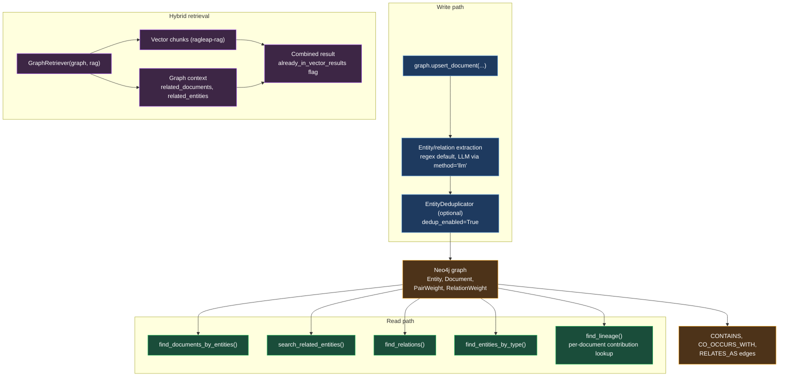

# ragleap-graph

Knowledge-graph-augmented retrieval for RAG systems — entity extraction, co-occurrence graphs, and graph-based document retrieval via Neo4j.

```bash
pip install ragleap-graph
```

## Quickstart

```python
from ragleap_graph import GraphConfig, GraphIndex

graph = GraphIndex(config=GraphConfig(
    uri="bolt://localhost:7687",
    user="neo4j",
    password="...",
))

graph.upsert_document(
    document_id="doc-1",
    title="Q3 Report",
    chunks=[{"text": "Acme Corp reported strong Q3 revenue growth."}],
)

docs = graph.find_documents_by_entities(["Acme Corp"])
related = graph.search_related_entities(["Acme Corp"], max_depth=2)
```

<!-- AUTO-STATS:START -->
**Current: v0.6.5** · 87 tests (86 passed, 1 skipped)
<!-- AUTO-STATS:END -->

## Architecture



## LLM-based extraction and dedup (v0.2.0+)

The default entity extraction is regex/heuristic-based (fast, free, zero
dependencies). For messier input — e.g. inconsistent capitalization like
"Acme Corp" vs "ACME Corp." — LLM-based extraction and dedup produce
cleaner graphs. Requires the `llm` extra: `pip install ragleap-graph[llm]`

```python
from ragleap.generation import ProviderConfig
from ragleap_graph import GraphConfig, GraphIndex, ExtractionConfig

graph = GraphIndex(
    config=GraphConfig(uri="bolt://localhost:7687", user="neo4j", password="..."),
    extraction=ExtractionConfig(
        method="llm",
        provider=ProviderConfig(provider="gemini", api_key="...", model="gemini-3.6-flash"),
        dedup_enabled=True,
    ),
)
```

Note: `EntityDeduplicator` merges spelling variants of an already-extracted
name; it does not fix fragmentation caused by the regex extractor splitting
one real-world entity into multiple candidates in the first place — see
CHANGELOG.md for a real, measured example of this and how `method="llm"`
avoids it at the source.

## Status

v0.6.5. Ported from a real production `GraphService`, adapted for standalone open-source use — see `HANDOFF.md` for the full design history. `ragleap-rag` >=0.12.0 is an optional dependency, required only for `method="llm"`.

## License

MIT
