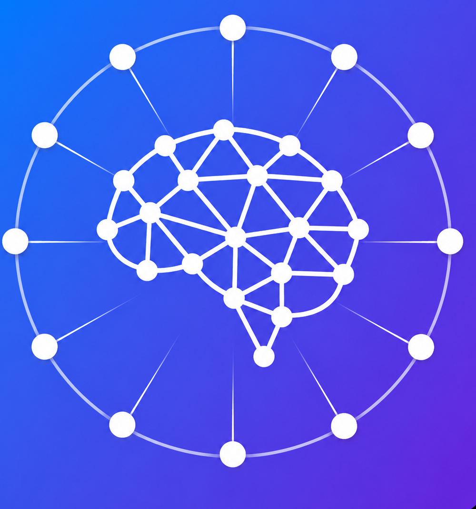

<div align="center">



# RagLeap Core

**自主 AI 智能体 — 不仅仅是 RAG。**

[](../LICENSE) [](https://github.com/antonyrag/ragleap-core) [](https://github.com/antonyrag/ragleap-core) [](https://github.com/antonyrag/ragleap-core)
[](https://pypi.org/project/ragleap-rag/) [](https://pypi.org/project/ragleap-rag/)

[English](../readme.md) · [Afrikaans](README.af.md) · [العربية](README.ar.md) · [Български](README.bg.md) · [বাংলা](README.bn.md) · [Català](README.ca.md) · [Čeština](README.cs.md) · [Cymraeg](README.cy.md) · [Dansk](README.da.md) · [Deutsch](README.de.md) · [Ελληνικά](README.el.md) · [Español](README.es.md) · [Eesti](README.et.md) · [فارسی](README.fa.md) · [Suomi](README.fi.md) · [Français](README.fr.md) · [ગુજરાતી](README.gu.md) · [עברית](README.he.md) · [हिन्दी](README.hi.md) · [Hrvatski](README.hr.md) · [Magyar](README.hu.md) · [Bahasa Indonesia](README.id.md) · [Italiano](README.it.md) · [日本語](README.ja.md) · [ಕನ್ನಡ](README.kn.md) · [한국어](README.ko.md) · [Lietuvių](README.lt.md) · [Latviešu](README.lv.md) · [Македонски](README.mk.md) · [മലയാളം](README.ml.md) · [मराठी](README.mr.md) · [नेपाली](README.ne.md) · [Nederlands](README.nl.md) · [Norsk](README.no.md) · [ਪੰਜਾਬੀ](README.pa.md) · [Polski](README.pl.md) · [Português](README.pt.md) · [Română](README.ro.md) · [Русский](README.ru.md) · [Slovenčina](README.sk.md) · [Slovenščina](README.sl.md) · [Soomaali](README.so.md) · [Shqip](README.sq.md) · [Svenska](README.sv.md) · [Kiswahili](README.sw.md) · [தமிழ்](README.ta.md) · [తెలుగు](README.te.md) · [ไทย](README.th.md) · [Tagalog](README.tl.md) · [Türkçe](README.tr.md) · [Українська](README.uk.md) · [اردو](README.ur.md) · [Tiếng Việt](README.vi.md) · [简体中文](README.zh-cn.md) · [繁體中文](README.zh-tw.md)

</div>

RagLeap Core 是 RagLeap 背后的开源引擎 — 一个自托管的智能体系统，在您自己的服务器上从您自己的文档运营您的业务，无任何供应商锁定。

**46 个基于角色的 AI 员工：** 9 个核心通用角色（AI 经理、秘书、CEO、销售、支持、HR、财务、营销、运营）以及 37 个垂直特定的全球角色。

**它的功能：**
- 自学习、结果加权的记忆
- 自动触发工作流程和升级
- 完全 / 半自主模式
- 思考-行动-决策循环，不仅仅是检索

[Quickstart](#快速开始) · [Docs](https://docs.ragleap.com) · [Website](https://ragleap.com) · [Hosted Version](https://ragleap.com) · [Packages](https://packages.ragleap.com/)

---

> **Not to be confused with `install.ragleap.com`** — that's a separate, paid, license-gated self-hosted product. `ragleap-core` (this repo) is MIT-licensed, completely free, and never requires a license key.

## Install

```bash
pip install ragleap-rag
```

> ⭐ 如果对您有帮助，请考虑给仓库加星 — 这真的能帮助更多人找到它。

Prefer Java? `ragleap-rag` is also on Maven Central:
```xml
<dependency>
    <groupId>io.github.antonyrag</groupId>
    <artifactId>ragleap-rag</artifactId>
    <version>0.5.0</version>
</dependency>
```

Add `ragleap-graph` for Neo4j-backed knowledge graph retrieval:
```bash
pip install ragleap-rag ragleap-graph
```

Add `ragleap-vectorstores` for pluggable vector backends:
```bash
pip install ragleap-rag ragleap-vectorstores[chroma]
```

## 功能

| | |
|---|---|
| 📄 **Document ingestion** | Upload PDFs, text, and common document formats |
| 🔍 **RAG retrieval** | Vector search over your documents via pgvector |
| 💬 **Chat with citations** | Answers reference the source document, not a black box |
| 🔌 **Bring your own AI key** | OpenAI, Gemini, Anthropic, or any OpenAI-compatible endpoint |
| 🌐 **Web chat widget** | Embed a chat widget on any website |
| 🐳 **Docker-based setup** | One-command local deployment |
| 🕸️ **Knowledge Graph (Neo4j)** | Entity extraction and graph-boosted retrieval alongside vector search |
| 🌍 **Language detection** | Auto-detects document and query language, applied across every channel |
| 🔗 **Integrations** | Connect MySQL, PostgreSQL, MongoDB, REST APIs, Salesforce, HubSpot, Shopify, Google Sheets, Stripe |
| 🔀 **Hybrid search** | Combines dense (vector) and sparse (full-text) retrieval via Reciprocal Rank Fusion |
| ⚡ **Streaming responses** | Answers stream token-by-token instead of waiting for the full response |
| 🔁 **Provider fallback** | Automatically retries with a backup LLM provider if the primary fails |
| 💰 **Token usage reporting** | Real per-call token counts from the provider |
| 🧑‍💼 **AI Employees** | Role-based agents (46 default roles) with persistent business-context memory |
| 🛠️ **Build your own AI Employee** | Define a fully custom role via `PATCH /employees/{role}` |
| 🔗 **n8n workflow automation** | Fire a webhook after the AI replies on WhatsApp/Telegram/Discord |

## 快速开始

**最快的试用方式** — 一条命令检查 Docker、克隆仓库并为您设置 `.env`：

```bash
curl -fsSL https://raw.githubusercontent.com/antonyrag/ragleap-core/main/install.sh | bash
```

(Windows users: run this in Git Bash, not Command Prompt or PowerShell.)

**Or, the manual way:**

```bash
git clone https://github.com/antonyrag/ragleap-core.git
cd ragleap-core
cp .env.example .env
# add your Gemini API key to .env
docker compose up --build -d
```

Requirements: Docker, Docker Compose, an API key from OpenAI, Google Gemini, or Anthropic.

## Supported LLM Providers (BYOK)

| `LLM_PROVIDER` value | Required env vars | Notes |
|---|---|---|
| `gemini` (default) | `GEMINI_API_KEY` | Get a key at aistudio.google.com/apikey |
| `anthropic` | `ANTHROPIC_API_KEY`, `ANTHROPIC_MODEL` | |
| `openai` | `OPENAI_API_KEY`, `OPENAI_MODEL` | |
| `mistral` | `MISTRAL_API_KEY`, `MISTRAL_MODEL` | |
| `groq` | `GROQ_API_KEY`, `GROQ_MODEL` | Free tier available |
| `ollama` | `OLLAMA_MODEL` (no API key needed) | Self-hosted |
| `deepseek` | `DEEPSEEK_API_KEY`, `DEEPSEEK_MODEL` | |
| `custom` | `CUSTOM_API_KEY`, `CUSTOM_MODEL`, `CUSTOM_BASE_URL` | Any OpenAI-compatible endpoint |

## Contributing

RagLeap Core is working, tested, and open for contributions now. See [CONTRIBUTING.md](../CONTRIBUTING.md) for how to get started.

## License

MIT © 2026 RagLeap
